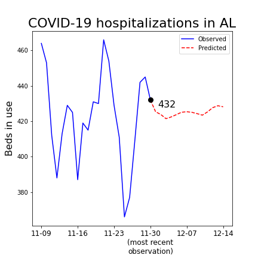
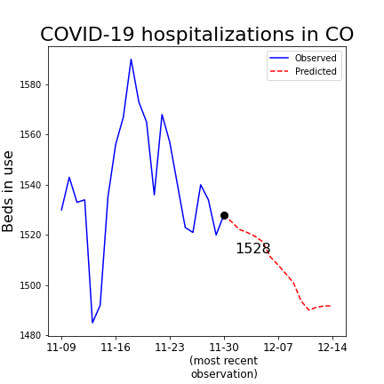
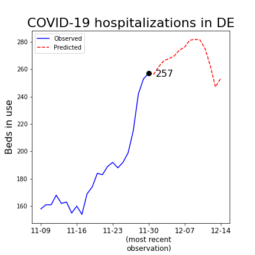
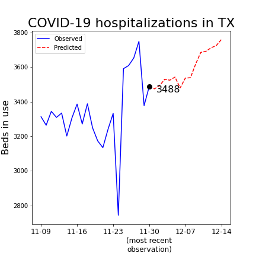

# COVID-19 Hospitalization Forecaster
## Project description
The COVID-19 pandemic has been wreaking havoc in the US since early 2020. Most epidemiologists agree that is is likely to become endemic. In most cases, when COVID-19 simply behaves like a cold of flu, it doesn't cause much disruption. However, each time COVID-19 spikes, there is a risk of the healthcare system becoming overwhelmed if more patients need hospitalisation than the number of beds available. 

The COVID-19 Hospitalization Forecaster cuts out the noise in the data. By distinguishing mild cases from hospitalizations, it provides actionable data. Our model predicts the number of hospital beds needed by COVID-19 patients up to 14 days into the future. This allows healthcare providers all over the country to figure out when to request or donate resources from each other. 

## Using our model
Open the notebook `models/optimal_model.ipynb` and run all the cells. This will download the most recent data from the CDC and train our models. To get 14-day forecast for your favorite state, e.g. Alabama, enter `get_prediction('AL')`. Some examples:

## Website and API
You can see graphs of all of our predictions on our website [https://covidforecast.net/](https://covidforecast.net/). You can also get predictions from our public API. For exampl, from the command line, try `curl covidforecast.net:5001/?state=AL`.

## About
This project was part of the Fall 2021 data science mini-course through the Erdős Institute.
The team members were Lara Du, Julian Rosen, and Kai Wei. Our project mentor was Ben Campbell.
